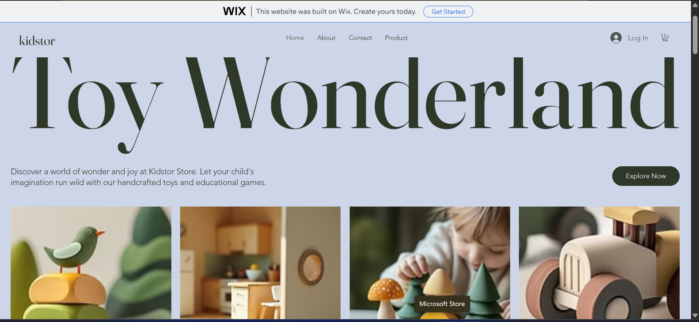
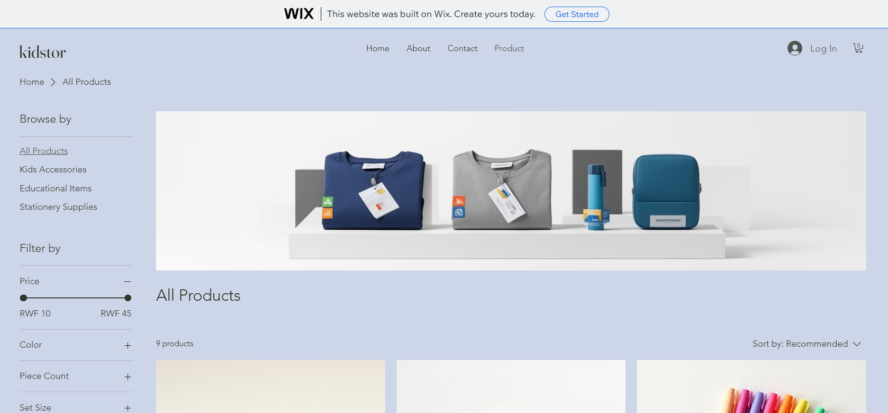
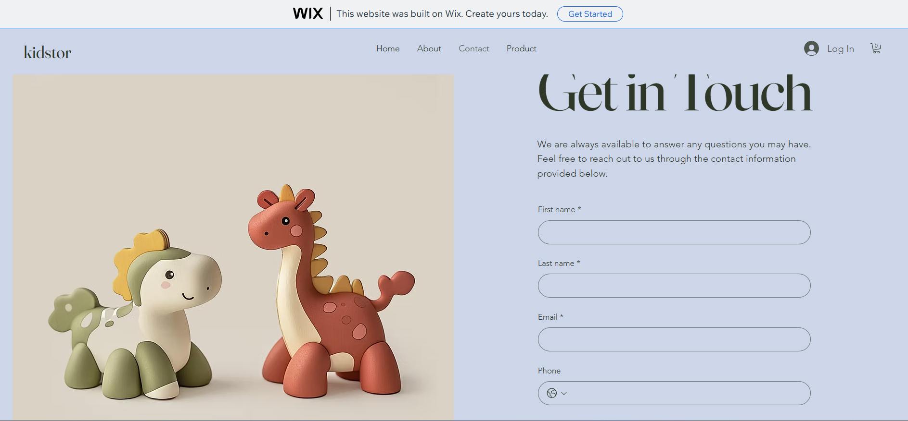

# E-Commerce No-Code Application

## Student Information

- Name: Munezero Patrick
- Registration Number: 24355/2024
- Course: E-Commerce and Web Application

## Project Title
 
 Kidstor

## Platform Used

Wix.com

## Features Implemented

- Homepage
- About Page
- Contact Page
- Product Page
  
## Screenshots

### Homepage

### Product Page

### Contact Page

## Challenges

- how to customize templates

## Lessons Learned

- Creating websites using no-code tools
- Basic e-commerce website structure
- GitHub documentation using Markdown

## Live Website Link

https://zero252patrick.wixsite.com/kids-accessories-sto

## GitHub Repository Link
https://github.com/Mzero-Patrick?tab=repositories
